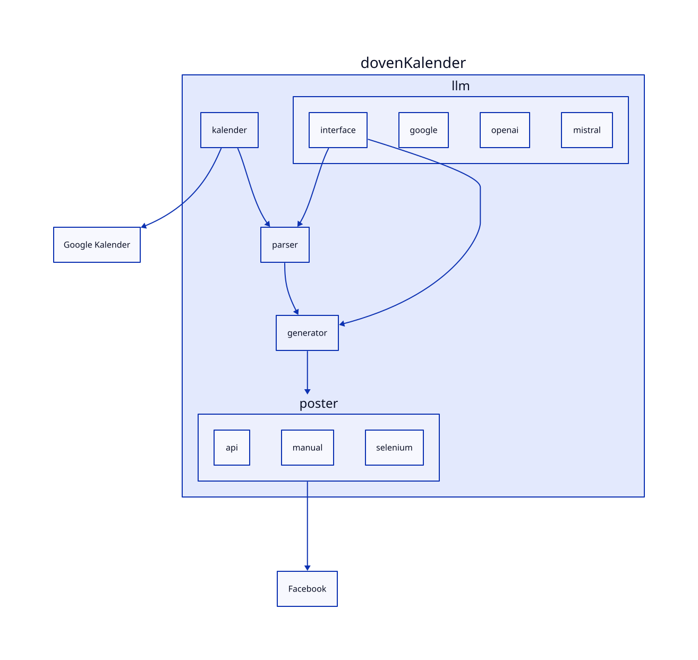

# Arkitektur

Dette dokument beskriver en ide til projektets arkitektur.

Figuren nedenfor beskriver det overordnet.

Pipeline er: `extractor -> parser -> integrator/generator`.
Parser og generator bruger samme abstrakte LLM-interface med optionalt
Pydantic-valideret structured output.
